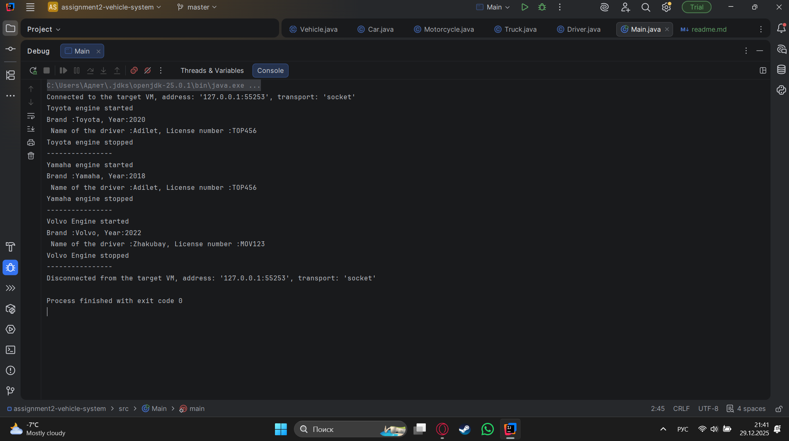

# Assignment 2 — Vehicle Management System

## Project Overview

This project is a simple **Vehicle Management System** written in Java. It was created to practice basic **Object-Oriented Programming (OOP)** concepts such as **inheritance**, **abstraction**, **composition**, **aggregation**, and **polymorphism**.

In this project, different types of vehicles (**Car**, **Motorcycle**, **Truck**) are modeled using a common abstract class **Vehicle**. Each vehicle can have a **Driver**, and one driver can be assigned to multiple vehicles.

---

## OOP Concepts Used

### Inheritance

The `Vehicle` class is a superclass, and `Car`, `Motorcycle`, and `Truck` are subclasses that extend it. This allows common fields and methods to be reused and reduces code duplication.

### Abstraction

`Vehicle` is an abstract class. It defines abstract methods like `startEngine()` and `stopEngine()` that must be implemented by all subclasses.

### Composition and Aggregation

Each `Vehicle` object contains a `Driver` object (composition). At the same time, one `Driver` can be assigned to more than one vehicle (aggregation).

### Polymorphism

All vehicle objects are stored in a `Vehicle[]` array. When methods are called, Java automatically uses the correct implementation depending on the actual vehicle type.

---

## Class Structure

* **Vehicle (abstract)** – base class with common fields and methods
* **Car** – has doors and fuel type
* **Motorcycle** – has information about a sidecar
* **Truck** – has capacity and number of axles
* **Driver** – stores driver name and license number

---

## How to Compile and Run

From the `src` folder, run:

```bash
javac *.java
java Main
```

---

## Program Output

The program starts and stops engines for different vehicles, displays vehicle information, and shows driver details. Screenshots of the output are included in the screenshots folder.

---



## Reflection

This assignment helped me better understand how inheritance and abstraction work in Java. Using a superclass made the code cleaner and easier to manage.

One of the main challenges was understanding the difference between composition and aggregation, but after implementing the Driver class and assigning it to multiple vehicles, it became clearer.

---

## Conclusion

Overall, this project helped me practice core OOP concepts and understand how different classes can work together in a Java program.
